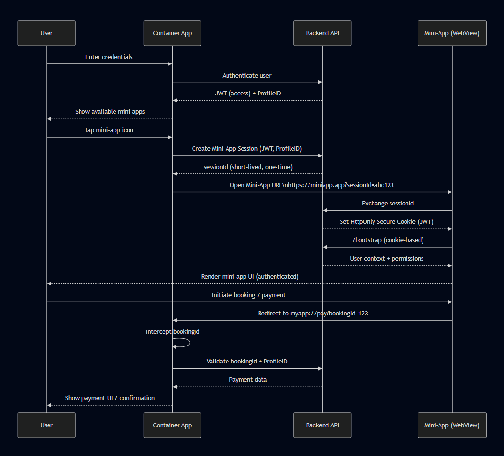

## 🧩 Mini App System Design — High-Level Overview

---

### 🎯 Purpose

The mini app system enables **secure, seamless access to web-based mini apps** inside a **Super App (Container App)** using a **WebView-based architecture**, while keeping authentication, payments, and sensitive operations centralized in the container and backend.

---

### 🏗️ Core Components

- **User**

  - Interacts with the Super App and Mini App UI

- **Container App (Super App)**

  - Handles authentication
  - Owns user identity and profile
  - Manages mini app lifecycle
  - Intercepts deep links (e.g., payment flows)

- **Backend API**

  - Authenticates users
  - Issues JWTs and short-lived session tokens
  - Validates permissions and transactions
  - Provides payment and booking data

- **Mini App (WebView)**

  - Lightweight, web-based UI
  - Runs in a sandboxed WebView
  - Relies on backend-issued cookies for authentication
  - Delegates sensitive flows (e.g., payments) to the container

---

### 🔐 Authentication & Session Flow (High-Level)

1. User logs in via the **Container App**
2. Backend returns an **access JWT + profile ID**
3. When a mini app is launched:

   - Container requests a **short-lived, one-time session ID**
   - Mini app is opened with this session ID

4. Backend exchanges the session ID for an **HttpOnly, Secure cookie**
5. Mini app bootstraps using **cookie-based authentication**
6. User context and permissions are fetched securely

✔ No JWTs are exposed to JavaScript
✔ Mini app never handles primary credentials

---

### 🔁 Mini App Interaction & Payment Flow

1. User performs actions inside the mini app (e.g., booking)
2. Mini app redirects to a **custom deep link** (e.g., `myapp://pay`)
3. Container App intercepts the deep link
4. Backend validates:

   - Booking ID
   - User profile

5. Container displays **native payment UI**
6. Confirmation is shown to the user

✔ Payments remain fully controlled by the Super App
✔ Mini app stays stateless and secure

---

### ✅ Key Design Benefits

- **Strong Security**

  - Short-lived sessions
  - HttpOnly cookies
  - No token leakage to WebView JS

- **Clear Responsibility Boundaries**

  - Container: identity, navigation, payments
  - Mini App: UI and feature logic
  - Backend: trust, validation, data

- **Scalable Mini App Ecosystem**

  - Independent mini app deployment
  - Centralized governance
  - Future-ready for micro-frontend expansion

- **Excellent User Experience**

  - Seamless transitions
  - No repeated login
  - Native payment flows

---

### 🧠 Design Principle Summary

> Mini apps are **capability extensions**, not standalone applications.
> The Super App remains the **source of truth** for identity, security, and critical business flows.
