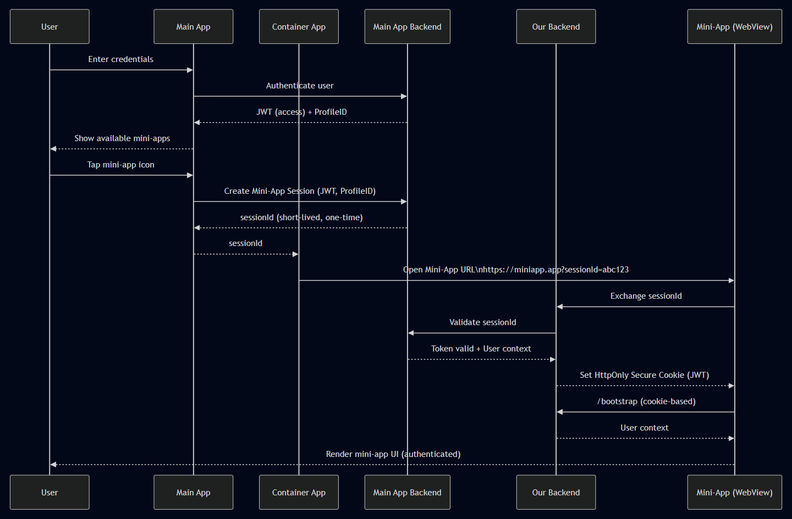
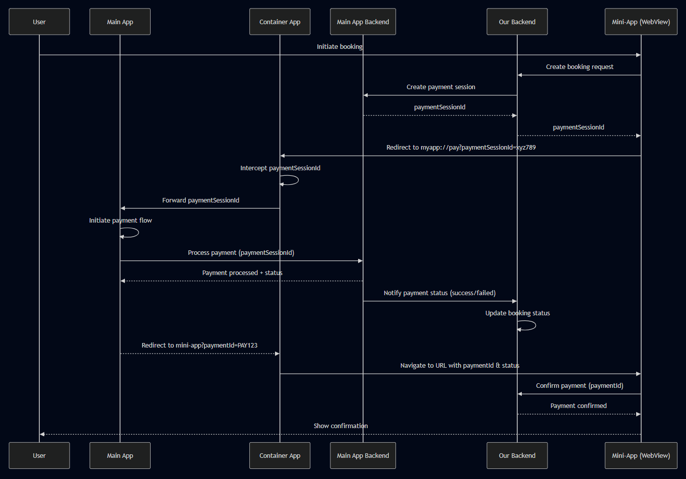
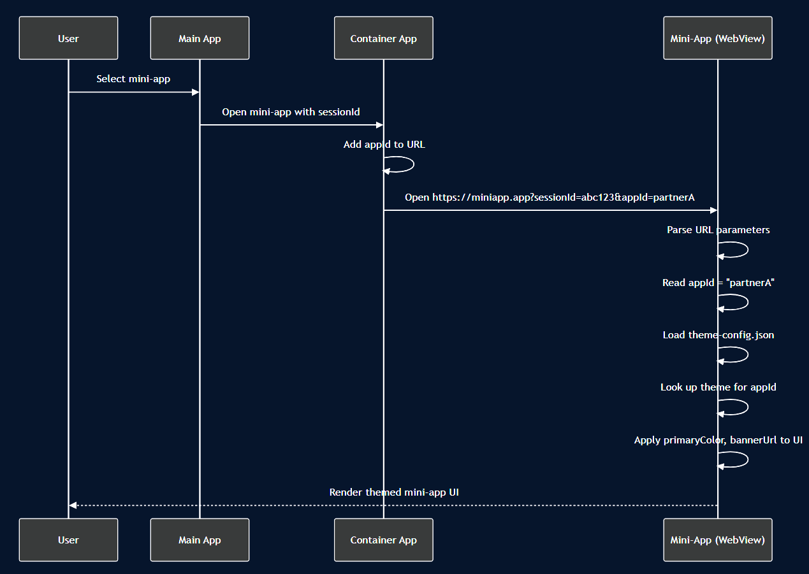

## 🧩 Mini App System Design — High-Level Overview

---

### 🎯 Purpose

The mini app system enables **secure, seamless access to web-based mini apps** inside a **Main App ecosystem** where a **Container App** serves as a WebView wrapper. Our backend acts as a **third-party service** that authenticates users via Main App's token without requiring separate login. All authentication, identity, and payment flows are centralized through the Main App ecosystem.

---

### 🏗️ Core Components

- **User**

  - Interacts with the Main App and Mini App UI
  - Logs in once via Main App (no separate login for mini apps)

- **Main App**

  - Entry point for user authentication
  - Manages mini app catalog and lifecycle
  - Creates mini-app sessions with Main App Backend
  - Passes session IDs to Container App
  - Acts as the orchestration layer between Our Backend and Container App
  - Receives deep link callbacks from Container App
  - Make payment flow with Main App Backend
  - Redirects mini app with paymentId after payment completion

- **Main App Backend**

  - Handles Main App authentication (user login)
  - Issues JWTs and short-lived session tokens
  - Validates user identity and permissions
  - Creates payment sessions for bookings
  - Processes payments
  - Notifies Our Backend of payment status
  - Acts as the source of truth for user identity and payment processing

- **Our Backend**

  - Third-party service provider
  - Receives and validates Main App session IDs
  - Provides mini app data and business logic
  - Creates booking requests and payment sessions
  - Receives payment status notifications from Main App Backend
  - Confirms payment status to mini app
  - Never requires separate user login - authenticates via Main App session ID

- **Container App**

  - Receives session ID from Main App
  - Stores App ID mapping for different Main Apps
  - Passes appId as URL query parameter to Mini App
  - Opens and renders Mini App WebView
  - Intercepts deep links from mini apps
  - Forwards callbacks and payment requests to Main App
  - Redirects mini app to URL with paymentId from Main App
  - Acts as a lightweight WebView host

- **Mini App (WebView)**

  - Lightweight, web-based UI
  - Runs in a sandboxed WebView
  - Reads appId from URL query parameters
  - Loads theme-config.json and applies themed UI
  - Authenticates with Our Backend using Main App session ID
  - Initiates booking requests to Our Backend
  - Receives payment session ID
  - Sends payment session ID to Container App via deep link
  - Confirms payment status with Our Backend after redirect

---

### 🔐 Authentication Flow



sequenceDiagram
participant U as User
participant MA as Main App
participant C as Container App
participant MAB as Main App Backend
participant OB as Our Backend
participant M as Mini-App (WebView)

    U->>MA: Enter credentials
    MA->>MAB: Authenticate user
    MAB-->>MA: JWT (access) + ProfileID

    MA-->>U: Show available mini-apps
    U->>MA: Tap mini-app icon

    MA->>MAB: Create Mini-App Session (JWT, ProfileID)
    MAB-->>MA: sessionId (short-lived, one-time)
    MA-->>C: sessionId

    C->>M: Open Mini-App URL\nhttps://miniapp.app?sessionId=abc123

    M->>OB: Exchange sessionId
    OB->>MAB: Validate sessionId
    MAB-->>OB: Token valid + User context
    OB-->>M: Set HttpOnly Secure Cookie (JWT)

    M->>OB: /bootstrap (cookie-based)
    OB-->>M: User context
    M-->>U: Render mini-app UI (authenticated)

**Authentication Flow Steps:**

1. User logs in via **Main App**
2. **Main App Backend** authenticates and returns JWT + ProfileID
3. User selects a mini app
4. Main App creates session with Main App Backend
5. Main App passes sessionId to Container App
6. Container App opens Mini App with sessionId
7. Mini App exchanges sessionId with Our Backend
8. Our Backend validates sessionId with Main App Backend
9. On success, Our Backend sets HttpOnly cookie
10. Mini App bootstraps and renders UI

✔ No JWTs are exposed to JavaScript.
✔ Mini app never handles primary credentials.
✔ Users don't need separate login - Main App token grants access.
✔ Our Backend trusts Main App's authentication.
✔ Container App only receives session ID, not JWT or ProfileID.

---

### 💳 Booking & Payment Flow



sequenceDiagram
participant U as User
participant MA as Main App
participant C as Container App
participant MAB as Main App Backend
participant OB as Our Backend
participant M as Mini-App (WebView)

    U->>M: Initiate booking
    M->>OB: Create booking request
    OB->>MAB: Create payment session
    MAB-->>OB: paymentSessionId
    OB-->>M: paymentSessionId

    M->>C: Redirect to myapp://pay?paymentSessionId=xyz789

    C->>C: Intercept paymentSessionId
    C->>MA: Forward paymentSessionId

    MA->>MA: Initiate payment flow
    MA->>MAB: Process payment (paymentSessionId)
    MAB-->>MA: Payment processed + status

    MAB->>OB: Notify payment status (success/failed)
    OB->>OB: Update booking status

    MA-->>C: Redirect to mini-app?paymentId=PAY123
    C->>M: Navigate to URL with paymentId & status

    M->>OB: Confirm payment (paymentId)
    OB-->>M: Payment confirmed
    M-->>U: Show confirmation

**Booking & Payment Flow Steps:**

1. **Booking Initiation**

   - User initiates booking in Mini App
   - Mini App sends booking request to Our Backend
   - Our Backend creates booking record

2. **Payment Session Creation**

   - Our Backend requests Main App Backend to create payment session
   - Main App Backend creates paymentSessionId (short-lived)
   - Payment session ID returned to Our Backend
   - Our Backend passes paymentSessionId to Mini App

3. **Payment Initiation**

   - Mini App redirects to Container App via deep link: `myapp://pay?paymentSessionId=xyz789`
   - Container App intercepts the deep link
   - Container App forwards paymentSessionId to Main App

4. **Payment Processing**

   - Main App initiates payment flow
   - Main App Backend processes the payment
   - Payment status returned to Main App

5. **Status Notification**

   - Main App Backend notifies Our Backend of payment status (success/failed)
   - Our Backend updates booking status

6. **Mini App Redirect**

   - Main App redirects Container App to mini app URL with paymentId
   - Example: `mini-app-url?paymentId=PAY123`
   - Container App navigates Mini App to this URL
   - Our Backend already knows payment status from notification

7. **Payment Confirmation**

   - Mini App receives paymentId
   - Mini App sends paymentId to Our Backend for confirmation
   - Our Backend verifies payment status and confirms
   - Mini App shows confirmation to user

✔ Our Backend orchestrates booking and payment session creation
✔ Main App Backend processes actual payments and notifies Our Backend
✔ Mini App never handles raw payment data
✔ Payment status flows: Main App Backend → Our Backend → Mini App (via redirect)
✔ Mini App confirms with Our Backend using paymentId

---

### ✅ Key Design Benefits

- **Strong Security**

  - Short-lived sessions
  - HttpOnly cookies
  - No token leakage to WebView JS
  - Centralized authentication via Main App
  - No separate user credentials needed
  - Container App only receives session ID, not full credentials
  - Payment processing isolated in Main App Backend

- **Clear Responsibility Boundaries**

  - Main App: user entry point, catalog, orchestration, session creation
  - Main App Backend: user identity, authentication, token issuance, payment processing, status notification
  - Our Backend: business logic, booking management, payment session coordination, payment confirmation
  - Container App: WebView rendering, deep link interception, callback bridge, app ID storage and passing
  - Mini App: UI and feature logic, theme loading and application, booking initiation, payment confirmation
  - Theme Config: local JSON file mapping App IDs to visual themes (colors, banners)

- **Third-Party Service Integration**

  - Our Backend operates as a third-party service
  - Trust established via token validation with Main App Backend
  - No user friction - single sign-on via Main App
  - Independent mini app deployment

- **Scalable Mini App Ecosystem**

  - Independent mini app deployment
  - Centralized governance via Main App
  - Multiple Container Apps can serve the same Main App ecosystem
  - Future-ready for micro-frontend expansion

- **Excellent User Experience**

  - Seamless transitions
  - No repeated login (single sign-on)
  - Native payment flows
  - Consistent experience across Container Apps

---

## 🎨 App Theme Customization

Mini apps can be customized with different **banners** and **colors** based on the **Main App** that launches them. Each Main App is assigned a unique **App ID**, which determines the visual theme applied to the mini app.

---

### 🏗️ Theme Configuration Components

- **Container App**

  - Stores mapping of Main App identifiers to App IDs
  - Passes App ID to Mini App via URL query parameter
  - Example: `https://miniapp.app?sessionId=abc123&appId=partnerA`

- **Mini App**

  - Contains a local `theme-config.json` file with App ID to theme mappings
  - Reads `appId` from URL query parameters on initialization
  - Applies the corresponding theme (colors, banner) to the UI
  - Supports fallback to default theme if appId is not found

- **Theme Configuration File** (`theme-config.json`)

  - Stores theme definitions mapped by App ID
  - Each theme includes: primary color, secondary color, banner URL, logo URL
  - Example structure:

  ```json
  {
    "default": {
      "primaryColor": "#007bff",
      "secondaryColor": "#6c757d",
      "bannerUrl": "https://cdn.example.com/default-banner.png"
    },
    "partnerA": {
      "primaryColor": "#e74c3c",
      "secondaryColor": "#c0392b",
      "bannerUrl": "https://cdn.example.com/partnera-banner.png"
    },
    "partnerB": {
      "primaryColor": "#27ae60",
      "secondaryColor": "#2ecc71",
      "bannerUrl": "https://cdn.example.com/partnerb-banner.png"
    }
  }
  ```

---

### 🎨 Theme Selection Flow



**Theme Selection Steps:**

1. User selects a mini app from Main App
2. Main App opens Container App with sessionId
3. Container App determines the App ID for this Main App
4. Container App adds `appId` as a query parameter to the mini app URL
5. Mini App loads and parses URL parameters
6. Mini App reads `appId` from URL
7. Mini App loads `theme-config.json` from local assets
8. Mini App looks up the theme configuration for the given `appId`
9. Mini App applies the theme (colors, banner) to the UI
10. If `appId` is not found, Mini App falls back to `default` theme

---

### ✅ Theme Customization Benefits

- **Brand Consistency**

  - Each Main App can have its own visual identity in mini apps
  - Colors and banners match Main App's branding

- **Easy Configuration**

  - Theme settings stored in a single JSON file
  - No code changes needed to add new themes
  - Simply add new entry to `theme-config.json`

- **Dynamic Theming**

  - Theme applied at runtime based on URL parameter
  - No rebuild required for theme changes
  - Supports multiple Main Apps with distinct identities

- **Fallback Safety**

  - Default theme ensures mini app always looks good
  - Graceful degradation if appId is missing or invalid

---

### 🧠 Design Principle Summary

> Mini apps are **capability extensions**, not standalone applications.
> The **Main App** remains the **source of truth** for identity and authentication.
> **Our Backend** operates as a trusted third-party service that authenticates via Main App's token.
> **Container App** serves as a lightweight WebView host that bridges the Main App and Mini Apps.
> **Session IDs** are short-lived and one-time, ensuring minimal exposure of sensitive data.
> **Payment flow** is orchestrated through Our Backend but executed by Main App Backend.
> **Payment status** is communicated via Main App Backend → Our Backend, while redirect uses paymentId.
> **Theme customization** is achieved via URL parameter passing and local JSON configuration.
> **Authentication** and **Booking/Payment** flows are separated for clarity and maintainability.
> **App ID** is passed from Container App to Mini App via URL query parameter for theme selection.
